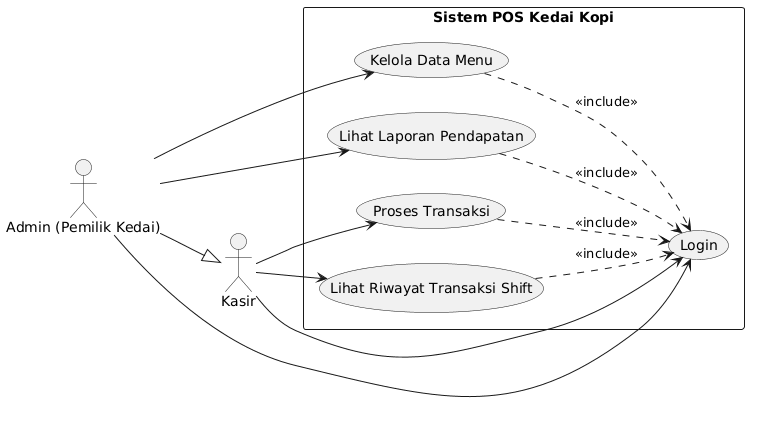

# Sistem POS Kedai Kopi

Sistem POS (Point of Sale) Kedai Kopi adalah aplikasi untuk mengelola transaksi penjualan, manajemen menu, dan laporan pendapatan di kedai kopi.

---

## 📋 Dokumentasi Diagram Sistem

### 1. Use Case Diagram - Sistem POS Kedai Kopi

#### Penjelasan:
Use case diagram menunjukkan interaksi antara aktor (Admin/Pemilik Kedai dan Kasir) dengan sistem. Komponen-komponen utama:

**Aktor:**
- **Admin (Pemilik Kedai)**: Pengguna dengan akses penuh terhadap sistem
- **Kasir**: Pengguna yang menangani transaksi penjualan

**Fitur Utama Sistem:**
1. **Kelola Data Menu**: Menambah, mengubah, atau menghapus data menu dan harga (diakses oleh Admin)
2. **Lihat Laporan Pendapatan**: Melihat detail laporan revenue/pendapatan (diakses oleh Admin)
3. **Proses Transaksi**: Mencatat transaksi penjualan saat pelanggan membeli (diakses oleh Kasir)
4. **Lihat Riwayat Transaksi Shift**: Melihat ringkasan transaksi dalam satu shift kerja (diakses oleh Kasir)
5. **Login**: Semua pengguna harus login terlebih dahulu untuk mengakses sistem

**Relasi:**
- Garis solid dengan panah menunjukkan interaksi langsung pengguna dengan fitur
- Garis dashed dengan `<<include>>` menunjukkan bahwa fitur-fitur tersebut harus melalui proses Login terlebih dahulu

---

### 2. Entity Relationship Diagram (ERD) - Struktur Database

.png)

#### Penjelasan:
ERD menunjukkan struktur database dan relasi antar tabel dalam sistem.

**Tabel dan Atribut:**

**1. Tabel `users`** (Penyimpanan Data Pengguna)
- `id` (INT) - Primary key, identitas unik pengguna
- `nama` (VARCHAR) - Nama lengkap pengguna
- `username` (VARCHAR) - Username untuk login
- `password` (VARCHAR) - Password terenkripsi untuk autentikasi

**2. Tabel `menus`** (Daftar Menu Minuman)
- `id` (INT) - Primary key, identitas unik menu
- `nama_menu` (VARCHAR) - Nama minuman (contoh: Cappuccino, Latte, dll)
- `kategori` (VARCHAR) - Kategori menu (contoh: Kopi, Teh, dll)
- `harga` (DECIMAL) - Harga satuan minuman

**3. Tabel `transactions`** (Catatan Transaksi)
- `id` (INT) - Primary key, identitas unik transaksi
- `tanggal_waktu` (TIMESTAMP) - Tanggal dan jam transaksi
- `total_bayar` (DECIMAL) - Total uang yang dibayarkan pelanggan
- `uang_diterima` (DECIMAL) - Jumlah uang cash yang diterima
- `uang_kembalian` (DECIMAL) - Uang kembalian untuk pelanggan

**4. Tabel `transaction_details`** (Detail Item per Transaksi)
- `id` (INT) - Primary key, identitas unik detail transaksi
- `kuantitas` (INT) - Jumlah item yang dibeli
- `subtotal` (DECIMAL) - Total harga untuk item tertentu

**Relasi Tabel:**
- `users` → `transactions`: Satu pengguna (kasir) dapat melakukan banyak transaksi (relasi 1:N via `user_id`)
- `transactions` → `transaction_details`: Satu transaksi memiliki banyak detail item (relasi 1:N)
- `menus` → `transaction_details`: Satu menu dapat muncul di banyak detail transaksi (relasi 1:N via `menu_id`)

---

### 3. Activity Diagram - Alur Proses Transaksi

#### Penjelasan:
Activity diagram menggambarkan alur proses transaksi dari sisi kasir dan sistem. Terbagi dalam 2 swimlane:

**Swimlane Kasir:**
1. **Buka Halaman Transaksi/Katalog** - Kasir membuka aplikasi dan melihat daftar menu
2. **Pilih/Klik Menu yang Diinginkan** - Kasir memilih minuman yang akan dijual
3. **Input Jumlah Uang Tunai** - Kasir memasukkan jumlah uang yang diterima dari pelanggan
4. **Terima Kembalian & Selesai** - Kasir menerima notifikasi kembalian dan transaksi selesai

**Swimlane Sistem:**
1. **Tambah Item Lain** - Sistem menawarkan opsi untuk menambah item lain
2. **System Update Kerajang & Total Harga** - Sistem memperbarui daftar item dan total harga otomatis
3. **Hitung Uang Kembalian** - Sistem menghitung jumlah kembalian
4. **Pesanan Sudah Selesai?** - Sistem melakukan pengecekan apakah pesanan sudah lengkap
5. **Uang Tunai < Total Harga?** - Sistem memvalidasi apakah uang yang diterima cukup:
   - **Tidak Cukup**: Tampilkan error "Uang Kurang"
   - **Cukup**: Lanjut ke nominal kembalian
6. **Tampilkan Nominal Kembalian** - Sistem menampilkan jumlah uang kembalian
7. **Simpan Transaksi ke Database** - Sistem menyimpan data transaksi lengkap
8. **Update Rekap Pendapatan Harian** - Sistem memperbarui laporan harian

---

### 4. BPMN Workflow Diagram - Alur Proses Bisnis Lengkap

.png)

#### Penjelasan:
BPMN menunjukkan workflow lengkap transaksi dari perspektif pelanggan, kasir, dan sistem. Terbagi dalam 3 swimlane:

**Swimlane Pelanggan:**
1. **Datang ke Meja Kasir & Memilih Menu** - Pelanggan datang dan memberitahu menu yang diinginkan
2. **Menyerahkan Uang Tunai untuk Pembayaran** - Pelanggan memberikan uang cash
3. **Menerima Uang Tunai untuk Pembayaran** - Pelanggan menerima kembalian (jika ada)
4. **Menerima Struktur & Uang Kembalian** - Pelanggan menerima nomor struktur dan sisa uang
5. **Menerima Pesanan Kopi** - Pelanggan menerima minuman yang dipesan

**Swimlane Kasir:**
1. **Membuka Aplikasi POS (Halaman Transaksi)** - Kasir membuka sistem
2. **Mencari & Mengklik Menu Sesuai Pesanan** - Kasir mencari dan memilih menu dari list
3. **Menerima Uang Tunai** - Kasir menerima uang dari pelanggan
4. **Menginputkan Total Harga ke Pelanggan** - Kasir menginformasikan total harga
5. **Meminta Uang Tunai** - Kasir meminta pembayaran
6. **Menginput Nominal Uang Tunai ke Sistem** - Kasir memasukkan jumlah uang yang diterima
7. **Menerima Kembali Uang (Jika Ada)** - Kasir menerima kembalian dari sistem
8. **Meminta Struktur & Uang Kembalian** - Kasir memberikan struk dan kembalian
9. **Menerima Struk & Uang Kembalian** - Kasir menyelesaikan transaksi

**Swimlane Sistem POS:**
1. **Menambahkan Item ke Kerajang** - Sistem menambahkan item ke cart
2. **Menghitung Otomatis Subtotal & Total Harga** - Sistem otomatis menghitung harga
3. **Semua Pesanan Sudah Diinput?** - Sistem mengecek apakah semua item sudah diinput
4. **Memvalidasi Kecukupan Nominal Uang** - Sistem mengecek apakah uang cukup:
   - **"Uang Kurang"**: Tampil peringatan uang tidak cukup
   - **"Uang Tunai = Total Harga"**: Pembayaran pas, tidak ada kembalian
5. **Menghitung nilai Uang Kembaliaan** - Sistem menghitung kembalian
6. **Memproses & Mengcund Data Transaksi** - Sistem menyimpan semua data transaksi
7. **Menyimpan Riwayat Transaksi ke Database** - Data disimpan secara permanen
8. **Memperbarui Rekap Laporan Pendapatan Harian** - Laporan harian diupdate otomatis

---

## 🔧 Fitur Utama Sistem

- ✅ **Manajemen Menu**: CRUD (Create, Read, Update, Delete) data menu dan harga
- ✅ **Proses Transaksi**: Input pesanan dan pembayaran real-time
- ✅ **Validasi Pembayaran**: Sistem otomatis mengecek kecukupan uang
- ✅ **Perhitungan Kembalian**: Hitung otomatis uang kembalian
- ✅ **Laporan Harian**: Rekap penjualan dan pendapatan per hari
- ✅ **Riwayat Shift**: Lihat transaksi dalam satu periode kerja
- ✅ **Manajemen Pengguna**: Login dan manajemen hak akses (Admin/Kasir)

---

## 💾 Struktur Database

Sistem menggunakan 4 tabel utama:
1. **users** - Data pengguna sistem
2. **menus** - Daftar menu minuman
3. **transactions** - Catatan setiap transaksi
4. **transaction_details** - Detail item per transaksi

Relasi antar tabel dirancang untuk memastikan data integritas dan kemudahan query laporan.

---

Dibuat sebagai dokumentasi Sistem POS Kedai Kopi.
# Tugas_APSI_Pertemuan_9
